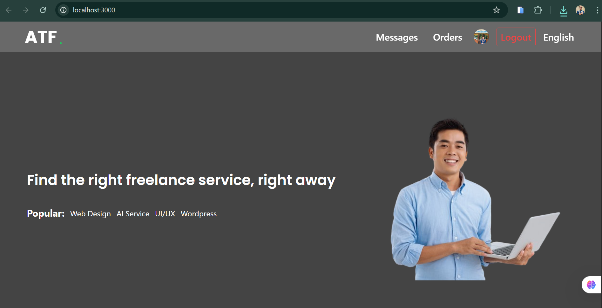
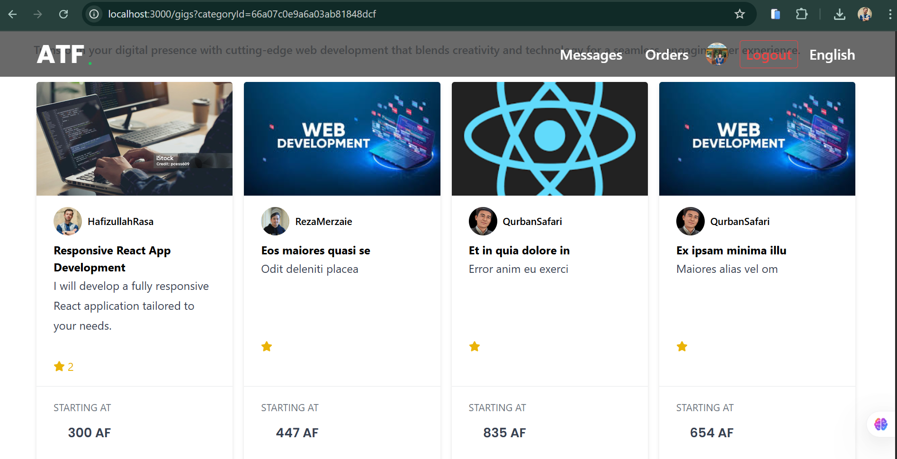
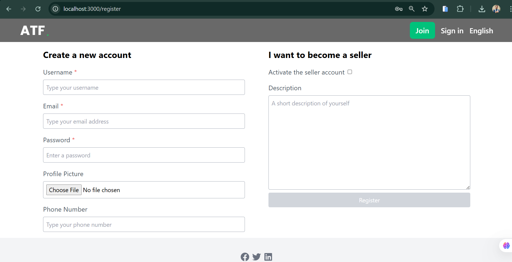

# 🌐 Afghan Tech Freelancers

> A specialized freelancing platform designed to empower Afghan developers and connect them with global opportunities.

---

## 📖 Overview

**Afghan Tech Freelancers** is an innovative MERN (MongoDB, Express.js, React, Node.js) stack-based web platform developed to bridge the gap between Afghan developers and the global freelancing market.

This initiative was born out of the recognition of the immense potential of Afghan tech professionals, who face significant barriers such as limited access to international financial systems and lack of localized platforms tailored to their unique socio-economic environment.

By providing a secure, scalable, and user-friendly environment, Afghan Tech Freelancers empowers Afghan developers to:

- Showcase their skills
- Connect with international clients
- Work on real-world freelance projects
- Contribute to the economic growth of Afghanistan’s tech industry

---

## 🎯 Key Features

- 🔒 **Authentication & Authorization** – Secure login, register, and profile management
- 📄 **Freelancer Profiles** – Highlight skills, experience, and portfolio
- 📊 **Project Listings** – Clients can post jobs and hire developers
- 💬 **Messaging System** – Direct communication between clients and developers
- 💵 **Order Management** – Custom gig-based or project-based hiring
- 🌍 **Multilingual Support** – English, Pashto, Dari (with RTL direction support)
- 📷 **Document Verification** – Upload Tazkira/Passport for verification
- 📈 **Admin Dashboard** – Manage users, jobs, reviews, and reported content

---

## 🖼️ Screenshots

| Home Page | Gig Listing | Sign Up Page |
|-----------|-------------|--------------|
| [Home] | [Gigs] | [Sign UP] |

## 🛠️ Tech Stack

### Frontend
- React.js
- Tailwind CSS
- React Router
- Axios
- i18next (for internationalization)

### Backend
- Node.js
- Express.js
- MongoDB (Mongoose)
- JSON Web Tokens (JWT)
- Multer (for file uploads)
- Stripe (for future payment integration)

---

## 📁 Project Structure

\`\`\`
afghan-tech-freelancers/
│
├── client/          # React Frontend
│   ├── components/
│   ├── pages/
│   ├── context/
│   └── i18n/
│
├── api/             # Node.js Backend
│   ├── controllers/
│   ├── models/
│   ├── routes/
│   └── middleware/
│
├── .env             # Environment Variables
├── README.md        # Project Documentation
└── package.json     # Project Config
\`\`\`

---

## 🚀 Getting Started

### 1. Clone the Repository

\`\`\`bash
git clone https://github.com/hafiz1379/afghan-tech-freelancers
cd afghan-tech-freelancers
\`\`\`

### 2. Setup Backend

\`\`\`bash
cd api
npm install
\`\`\`

Create a \`.env\` file in the \`api\` folder and add:

\`\`\`env
PORT=8000
NODE_ENV=DEVELOPMENT
DB_URI=your_mongo_connection_string
JWT_SECRET=your_jwt_secret
\`\`\`

Run backend:

\`\`\`bash
npm run dev
\`\`\`

### 3. Setup Frontend

\`\`\`bash
cd ../client
npm install
\`\`\`

Create a \`.env\` file in the \`client\` folder and add:

\`\`\`env
VITE_API_BASE_URL=http://localhost:8000/api
\`\`\`

Run frontend:

\`\`\`bash
npm run dev
\`\`\`

---

## 🤝 Contributing

We welcome contributions from developers around the world, especially those passionate about tech empowerment in underrepresented communities.

1. Fork the project
2. Create your feature branch (\`git checkout -b feature/myFeature\`)
3. Commit your changes (\`git commit -m 'Add some feature'\`)
4. Push to the branch (\`git push origin feature/myFeature\`)
5. Create a Pull Request

---

## 📄 License

This project is open-source and available under the [MIT License](LICENSE).

---

## 📢 Acknowledgements

Special thanks to the Afghan developer community and all open-source contributors who make this project possible.

---

## 🧑‍💻 Authors

**Hafizullah Rasa**  
📧 [hafizrasa1379@gmail.com](hafizrasa1379@gmail.com)  
🌐 [Portfolio Website](https://hafiz1379.github.io/Portfolio/)  
🔗 [LinkedIn](https://www.linkedin.com/in/hafiz1379)

**Anwar Hussaini**  
📧 [anwarhussaini160@gmail.com](anwarhussaini160@gmail.com)  
🌐 [Portfolio Website](https://github.com/M-Anwar-Hussaini)
🔗 [LinkedIn](https://www.linkedin.com/in/anwar-hussaini/)

> “This platform is not just a technological solution — it's a step toward digital inclusion and economic empowerment for Afghan developers.”
